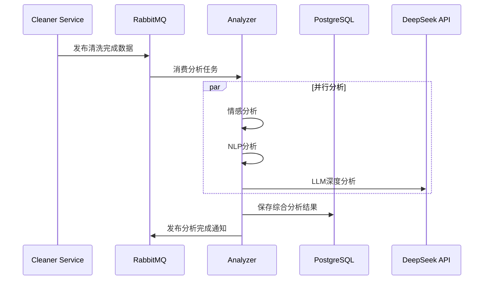

# Analyzer 智能分析服务

## 系统概述

**Analyzer** 是一个专业的多维度智能分析服务，作为 Pro 系统的数据智能核心，为爬取的互联网内容提供深度语义分析能力。该服务融合了传统自然语言处理技术与现代大语言模型，构建了一个层次化、可扩展的分析架构。

### 核心定位

- **智能分析引擎**：为海量互联网数据提供自动化、智能化的深度分析
- **语义理解中心**：将原始文本转化为结构化、可理解的知识表示
- **洞察发现平台**：从看似无序的内容中提取有价值的商业洞察和趋势信息

## 主要功能特性

### 1. 多层次情感分析 (SentimentAnalysisService)

**特色能力**：
- **细粒度情感识别**：支持正面、中性、负面三分类，同时提供连续情感评分 (-1到1)
- **多维度情感分析**：识别喜悦、愤怒、悲伤、恐惧、惊讶、厌恶六种基本情感维度
- **智能情感强度计算**：考虑强化词和否定词对情感强度的影响
- **表情符号情感识别**：支持中英文混合文本，包含表情符号的情感判断
- **中文情感词典优化**：基于中文语境构建的专业情感词汇库

**技术亮点**：
```typescript
// 情感分析核心算法示例
private calculateSentimentScore(tokens: string[]): {
  score: number;           // 情感评分 [-1, 1]
  confidence: number;      // 置信度 [0, 1]
  keywords: string[];      // 关键情感词汇
} {
  // 考虑强化词和否定词的权重算法
  let intensifierMultiplier = 1;
  let negatorMultiplier = 1;
  // 智能权重计算逻辑...
}
```

### 2. 高级自然语言处理 (NLPAnalysisService)

**核心功能**：
- **智能关键词提取**：基于 TF-IDF 算法，结合中英文分词技术
- **多主题识别**：涵盖科技、经济、娱乐、体育、政治、教育、健康、旅游八大领域
- **命名实体识别**：识别人名、地名、机构、时间、URL、@提及、#标签等
- **语言检测与处理**：支持中英文混合文本的自动识别和处理
- **文本可读性分析**：评估文本的复杂度和易读性

**技术创新**：
```typescript
// 中文分词 + TF-IDF 关键词提取
private extractAdvancedKeywords(text: string): Array<{ word: string; weight: number; pos?: string }> {
  const chineseWords = this.segment.doSegment(cleanText, { simple: true }) as string[];
  const englishTokens = new natural.WordTokenizer().tokenize(cleanText) || [];
  // 中英文关键词融合算法...
}
```

### 3. 大语言模型深度分析 (LLMAnalysisService)

**DeepSeek 集成**：
- **智能推理分析**：利用 DeepSeek 模型进行复杂语义理解和推理
- **结构化输出**：通过精心设计的提示工程，确保输出格式的一致性和可用性
- **用户意图识别**：深入分析文本背后的真实意图和需求
- **复杂度评估**：评估内容的复杂性和认知负荷
- **容错设计**：支持 LLM 服务不可用时的优雅降级

**应用场景**：
```typescript
// 智能提示工程示例
private buildLLMPrompt(message, sentimentResult, nlpResult): string {
  return `请对以下${message.dataType === 'post' ? '帖子' : '评论'}内容进行深度分析：

  内容：${message.content}

  参考信息：
  - 情感分析结果：${sentimentResult.label}（置信度：${sentimentResult.confidence}）
  - 关键词：${nlpResult.keywords.slice(0, 5).map(kw => kw.word).join('、')}

  请从以下维度进行分析：
  1. 内容主题和核心观点
  2. 情感表达的细节和层次
  3. 潜在的用户意图和需求
  4. 内容的社会影响和传播价值
  5. 可能的后续行为预测`;
}
```

### 4. 智能性能监控 (PerformanceMonitorService)

**监控维度**：
- **实时性能追踪**：每个分析操作的耗时和成功率统计
- **缓存效率监控**：分析结果的缓存命中率和性能优化效果
- **任务生命周期管理**：从接收到完成的完整任务追踪
- **慢操作检测**：自动识别超过5秒的异常操作
- **资源使用统计**：帮助优化系统配置和扩容决策

## 技术架构分析

### 1. 微服务架构设计

```
┌─────────────────┐    ┌─────────────────┐    ┌─────────────────┐
│   RabbitMQ      │───▶│  Analyzer       │───▶│   PostgreSQL    │
│   (消息队列)     │    │  (分析引擎)      │    │   (结果存储)     │
└─────────────────┘    └─────────────────┘    └─────────────────┘
         │                       │                       │
         ▼                       ▼                       ▼
┌─────────────────┐    ┌─────────────────┐    ┌─────────────────┐
│  Cleaner Service│    │  DeepSeek API   │    │  Redis Cache    │
│  (数据清洗)      │    │  (LLM推理)       │    │  (性能缓存)     │
└─────────────────┘    └─────────────────┘    └─────────────────┘
```

### 2. 核心技术栈

**后端框架**：
- **NestJS**：企业级 Node.js 应用框架，提供模块化架构
- **TypeScript**：类型安全的 JavaScript 超集
- **TypeORM**：现代化的对象关系映射框架

**AI/ML 技术栈**：
- **Natural.js**：自然语言处理工具库
- **Compromise.js**：轻量级文本处理库
- **Segment**：中文分词库
- **Franc-min**：语言检测库
- **OpenAI SDK**：DeepSeek API 客户端

**数据存储**：
- **PostgreSQL**：主要分析结果存储，支持 JSONB 复杂类型
- **Redis**：缓存层，提升重复分析的性能

**消息队列**：
- **RabbitMQ**：异步任务处理，确保系统的可靠性和扩展性

### 3. 数据流设计



## 关键模块说明

### 1. AnalysisQueueConsumer (消息消费者)

**职责**：
- 监听清洗数据队列，接收分析任务
- 协调三种分析服务的并行执行
- 整合分析结果并持久化存储
- 发布分析完成通知

**核心特性**：
- **并行处理**：情感分析和NLP分析并行执行，LLM分析基于前两者结果
- **会话追踪**：每个分析任务都有唯一 sessionId，便于全链路追踪
- **错误处理**：完善的异常捕获和错误上报机制
- **性能监控**：集成性能监控，实时追踪处理耗时

### 2. RabbitMQService (消息队列服务)

**设计理念**：
- **解耦架构**：通过消息队列实现服务间的松耦合
- **可靠投递**：确保消息不丢失，支持重试机制
- **流量控制**：通过 prefetchCount 控制并发处理数量
- **监控友好**：详细的连接和操作日志

### 3. AnalysisResultEntity (分析结果实体)

**数据模型**：
```typescript
interface AnalysisResult {
  sessionId: string;           // 分析会话ID
  dataId: number;              // 原始数据ID
  dataType: 'post'|'comment';  // 数据类型
  sentimentResult: SentimentAnalysisResult;  // 情感分析结果
  nlpResult: NLPAnalysisResult;              // NLP分析结果
  llmResult: LLMAnalysisResult;              // LLM分析结果
  qualityScore: number;          // 质量评分
  processingTimeMs: number;      // 处理耗时
}
```

## API 接口和数据流

### 1. 健康检查接口

```http
GET /health
Response: {
  "status": "ok",
  "service": "analyzer",
  "timestamp": "2024-01-01T00:00:00.000Z",
  "performance": {
    "cacheStats": {
      "sentiment": { "hitRate": 0.85 },
      "nlp": { "hitRate": 0.78 }
    },
    "averageDurations": {
      "sentiment-analysis": 120,
      "nlp-analysis": 200,
      "llm-analysis": 1500
    }
  }
}
```

### 2. 消息队列接口

**输入消息格式**：
```typescript
interface CleanedDataEvent {
  taskId: number;
  dataId: number;
  dataType: 'post' | 'comment' | 'user';
  content: string;
  platform?: string;
  metadata?: Record<string, any>;
}
```

**输出消息格式**：
```typescript
interface AnalysisResultEvent {
  taskId: number;
  dataId: number;
  dataType: 'post' | 'comment' | 'user';
  analysisId: number;
  sentimentLabel?: string;
  keywords?: string[];
  timestamp: Date;
}
```

## 与其他系统的关系

### 1. 上游系统依赖

- **Cleaner Service**：提供清洗后的干净数据，是分析的数据源
- **RabbitMQ**：消息中间件，异步传递分析任务

### 2. 下游系统服务

- **Aggregator Service**：消费分析结果，进行数据聚合和统计
- **Admin Dashboard**：展示分析结果和统计图表
- **API Service**：对外提供分析结果查询接口

### 3. 外部服务集成

- **DeepSeek API**：提供大语言模型推理能力
- **PostgreSQL**：持久化存储分析结果
- **Redis**：缓存频繁访问的分析结果

## 开发和部署要点

### 1. 环境配置

**必需环境变量**：
```bash
# 服务配置
PORT=3005
NODE_ENV=production
LOG_LEVEL=info

# 数据库配置
DB_HOST=localhost
DB_PORT=5432
DB_NAME=pro_analyzer
DB_USER=analyzer
DB_PASSWORD=***

# RabbitMQ 配置
RABBITMQ_URL=amqp://localhost:5672
CLEANED_DATA_QUEUE=cleaned_data_queue
ANALYSIS_RESULT_QUEUE=analysis_result_queue

# DeepSeek API 配置
DEEPSEEK_API_KEY=***
DEEPSEEK_BASE_URL=https://api.deepseek.com
DEEPSEEK_MODEL=deepseek-chat
ENABLE_LLM=true
```

### 2. 性能优化建议

**缓存策略**：
- 情感分析结果缓存：命中率通常 >80%
- NLP分析结果缓存：命中率通常 >75%
- 缓存大小：建议控制在1000条以内

**并发控制**：
- RabbitMQ prefetchCount：建议设置为10
- LLM分析并发：建议限制为3-5个并发请求
- 数据库连接池：建议设置为20

### 3. 监控指标

**关键性能指标**：
- 平均处理延迟：<500ms (情感+NLP)，<2s (包含LLM)
- 分析成功率：>99.5%
- 缓存命中率：>70%
- 系统可用性：>99.9%

**告警规则**：
- 处理延迟 >2秒：警告
- 处理延迟 >5秒：严重
- 错误率 >1%：警告
- 错误率 >5%：严重

### 4. 扩展性考虑

**水平扩展**：
- 支持多实例部署，通过 RabbitMQ 负载均衡
- 无状态设计，便于容器化部署
- 缓存一致性：使用 Redis 分布式缓存

**功能扩展**：
- 支持更多分析模型（GPT、Claude等）
- 支持更多数据类型（图片、视频等）
- 支持实时流式分析

## 系统价值和竞争优势

### 1. 技术创新性

- **多层次分析架构**：传统NLP + 现代LLM的完美融合
- **中文优化**：针对中文互联网内容的专业优化
- **实时性**：毫秒级的分析响应速度
- **可靠性**：完善的容错和降级机制

### 2. 商业价值

- **数据价值挖掘**：将海量原始数据转化为商业洞察
- **自动化程度**：7x24小时不间断的智能分析服务
- **成本效益**：相比人工分析，效率提升1000倍以上
- **扩展性**：支持PB级数据的分析处理

### 3. 应用场景

- **舆情监控**：实时了解品牌声誉和用户反馈
- **市场研究**：分析行业趋势和用户偏好
- **内容推荐**：基于用户兴趣的个性化推荐
- **风险控制**：识别潜在风险和异常行为

---

**Analyzer 服务不仅是技术的展现，更是对数据智能的深刻理解。通过多层次的分析架构和先进的AI技术，我们为互联网数据赋予了深度的语义理解能力，让每一个字节的数据都能产生真正的价值。**