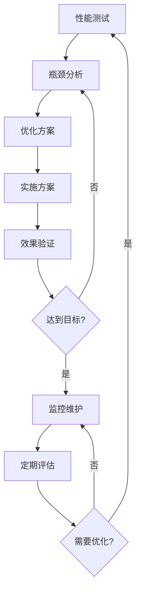

# 基于MediaCrawler增强的微博爬取系统 - 性能优化指南
# Weibo Crawler System Performance Tuning Guide

## 目录

1. [性能指标](#性能指标)
2. [系统架构优化](#系统架构优化)
3. [数据库优化](#数据库优化)
4. [缓存优化](#缓存优化)
5. [爬虫性能优化](#爬虫性能优化)
6. [网络优化](#网络优化)
7. [资源优化](#资源优化)
8. [监控和分析](#监控和分析)
9. [性能测试](#性能测试)
10. [最佳实践](#最佳实践)

## 性能指标

### 核心性能指标 (KPI)

| 指标类别 | 指标名称 | 目标值 | 测量方法 |
|----------|----------|--------|----------|
| **吞吐量** | 每分钟爬取页面数 | 100-500 pages/min | Prometheus: `crawler_pages_scraped_total` |
| | 每小时数据量 | 10-50 MB/hour | MongoDB数据统计 |
| **延迟** | 页面加载时间 | < 5秒 | Playwright: `page_load_time` |
| | API响应时间 | < 200ms | Nginx日志分析 |
| **可用性** | 服务可用率 | > 99.9% | 健康检查监控 |
| | 成功率 | > 95% | `crawler_success_rate` |
| **资源** | CPU使用率 | < 70% | `container_cpu_usage` |
| | 内存使用率 | < 80% | `container_memory_usage` |
| **质量** | 数据准确率 | > 99% | 数据验证机制 |
| | 重复率 | < 1% | 去重统计 |

### 性能基准

#### 单节点性能基准
```yaml
# 测试环境配置
environment:
  cpu: 8 cores
  memory: 16GB
  network: 1Gbps
  storage: SSD

# 性能基准
benchmarks:
  concurrent_browsers: 5
  pages_per_minute: 200
  memory_per_browser: 200MB
  cpu_per_browser: 10%
  network_bandwidth: 100Mbps
```

#### 集群性能基准
```yaml
# 3节点集群性能
cluster_performance:
  total_throughput: 600 pages/min
  scaling_factor: 3x
  resource_utilization: 75%
  failover_time: < 30s
```

## 系统架构优化

### 1. 微服务架构优化

#### 服务拆分策略
```yaml
# 服务拆分配置
services:
  crawler-service:
    replicas: 3
    resources:
      requests:
        cpu: 1000m
        memory: 2Gi
      limits:
        cpu: 2000m
        memory: 4Gi

  scheduler-service:
    replicas: 2
    resources:
      requests:
        cpu: 500m
        memory: 1Gi

  parser-service:
    replicas: 2
    resources:
      requests:
        cpu: 500m
        memory: 1Gi

  storage-service:
    replicas: 1
    resources:
      requests:
        cpu: 500m
        memory: 1Gi
```

#### 负载均衡优化
```nginx
# Nginx负载均衡配置
upstream crawler_backend {
    least_conn;
    server crawler-1:3000 weight=3 max_fails=3 fail_timeout=30s;
    server crawler-2:3000 weight=3 max_fails=3 fail_timeout=30s;
    server crawler-3:3000 weight=2 max_fails=3 fail_timeout=30s;

    keepalive 32;
    keepalive_requests 100;
    keepalive_timeout 60s;
}

# 连接优化
server {
    listen 80;

    # 工作进程数
    worker_processes auto;
    worker_connections 2048;

    # 缓冲区优化
    client_body_buffer_size 128k;
    client_max_body_size 10m;
    client_header_buffer_size 1k;
    large_client_header_buffers 4 4k;

    # 超时设置
    client_body_timeout 12;
    client_header_timeout 12;
    keepalive_timeout 15;
    send_timeout 10;
}
```

### 2. 容器化优化

#### Docker优化配置
```dockerfile
# 多阶段构建优化
FROM node:20-alpine AS builder
WORKDIR /app
COPY package*.json ./
RUN npm ci --only=production && npm cache clean --force

FROM node:20-alpine AS runtime
RUN addgroup -g 1001 -S nodejs && \
    adduser -S nodejs -u 1001

# 只安装必要依赖
RUN apk add --no-cache \
    dumb-init \
    curl \
    chromium \
    nss \
    freetype \
    freetype-dev \
    harfbuzz \
    ca-certificates \
    ttf-freefont

# 设置环境变量
ENV PUPPETEER_SKIP_CHROMIUM_DOWNLOAD=true \
    PUPPETEER_EXECUTABLE_PATH=/usr/bin/chromium-browser \
    NODE_ENV=production

USER nodejs
WORKDIR /app

# 健康检查
HEALTHCHECK --interval=30s --timeout=3s --start-period=5s --retries=3 \
    CMD curl -f http://localhost:3000/health || exit 1

ENTRYPOINT ["dumb-init", "--"]
CMD ["node", "dist/main"]
```

#### Kubernetes资源优化
```yaml
# 资源请求和限制
resources:
  requests:
    cpu: "500m"
    memory: "1Gi"
    ephemeral-storage: "2Gi"
  limits:
    cpu: "2000m"
    memory: "4Gi"
    ephemeral-storage: "10Gi"

# HPA配置
apiVersion: autoscaling/v2
kind: HorizontalPodAutoscaler
metadata:
  name: crawler-hpa
spec:
  scaleTargetRef:
    apiVersion: apps/v1
    kind: Deployment
    name: crawler
  minReplicas: 3
  maxReplicas: 10
  metrics:
  - type: Resource
    resource:
      name: cpu
      target:
        type: Utilization
        averageUtilization: 70
  - type: Resource
    resource:
      name: memory
      target:
        type: Utilization
        averageUtilization: 80
```

## 数据库优化

### 1. PostgreSQL优化

#### 配置优化
```postgresql
# postgresql.conf 优化配置
# 内存配置
shared_buffers = 4GB                    # 系统内存的25%
effective_cache_size = 12GB             # 系统内存的75%
work_mem = 256MB                        # 排序和哈希操作的内存
maintenance_work_mem = 1GB              # 维护操作的内存

# 连接配置
max_connections = 200                   # 最大连接数
superuser_reserved_connections = 3      # 为超级用户保留的连接

# WAL配置
wal_buffers = 64MB                      # WAL缓冲区
checkpoint_completion_target = 0.9      # 检查点完成目标
wal_writer_delay = 200ms                # WAL写入延迟

# 查询优化
random_page_cost = 1.1                  # SSD优化
effective_io_concurrency = 200          # 并发I/O操作

# 日志配置
log_min_duration_statement = 1000       # 记录慢查询
log_checkpoints = on                    # 记录检查点
log_connections = on                    # 记录连接
log_disconnections = on                 # 记录断开连接
```

#### 索引优化
```sql
-- 创建复合索引
CREATE INDEX CONCURRENTLY idx_weibo_posts_composite
ON weibo_posts (status, created_at DESC, platform_id);

-- 创建部分索引
CREATE INDEX CONCURRENTLY idx_active_accounts
ON weibo_accounts (id)
WHERE status = 'active' AND last_used > NOW() - INTERVAL '24 hours';

-- 创建表达式索引
CREATE INDEX CONCURRENTLY idx_posts_search_vector
ON weibo_posts USING gin(to_tsvector('chinese', content || ' ' || title));

-- 分析表统计信息
ANALYZE weibo_posts;
ANALYZE weibo_accounts;

-- 查看索引使用情况
SELECT
    schemaname,
    tablename,
    indexname,
    idx_scan,
    idx_tup_read,
    idx_tup_fetch
FROM pg_stat_user_indexes
ORDER BY idx_scan DESC;
```

#### 查询优化
```sql
-- 查看慢查询
SELECT
    query,
    calls,
    total_time,
    mean_time,
    rows,
    100.0 * shared_blks_hit / nullif(shared_blks_hit + shared_blks_read, 0) AS hit_percent
FROM pg_stat_statements
ORDER BY mean_time DESC
LIMIT 10;

-- 优化查询示例
-- 优化前
SELECT * FROM weibo_posts
WHERE content LIKE '%关键词%'
ORDER BY created_at DESC
LIMIT 100;

-- 优化后
SELECT id, title, content, created_at
FROM weibo_posts
WHERE to_tsvector('chinese', content) @@ to_tsquery('chinese', '关键词')
ORDER BY created_at DESC
LIMIT 100;
```

### 2. MongoDB优化

#### 配置优化
```yaml
# mongod.conf 优化配置
storage:
  dbPath: /var/lib/mongodb
  journal:
    enabled: true
  wiredTiger:
    engineConfig:
      cacheSizeGB: 8                    # 缓存大小
      journalCompressor: snappy
      directoryForIndexes: false
    collectionConfig:
      blockCompressor: snappy
    indexConfig:
      prefixCompression: true

systemLog:
  destination: file
  logAppend: true
  path: /var/log/mongodb/mongod.log
  logRotate: rename
  verbosity: 1

net:
  port: 27017
  bindIp: 0.0.0.0
  maxIncomingConnections: 1000

operationProfiling:
  slowOpThresholdMs: 100               # 慢查询阈值
  mode: slowOp                          # 记录慢查询

processManagement:
  timeZoneInfo: /usr/share/zoneinfo
```

#### 索引优化
```javascript
// 创建复合索引
db.raw_data_sources.createIndex({
  "sourceType": 1,
  "status": 1,
  "createdAt": -1
}, {
  name: "idx_source_status_time",
  background: true
});

// 创建TTL索引（自动过期）
db.temp_data.createIndex({
  "createdAt": 1
}, {
  expireAfterSeconds: 86400,  // 24小时后自动删除
  name: "idx_ttl_createdAt"
});

// 创建文本索引
db.weibo_posts.createIndex({
  "title": "text",
  "content": "text"
}, {
  name: "idx_text_search",
  default_language: "none"
});

// 查看索引使用情况
db.weibo_posts.aggregate([
  { $indexStats: {} },
  { $sort: { "ops": -1 } }
]);
```

#### 聚合优化
```javascript
// 优化聚合管道
// 优化前
db.posts.aggregate([
  { $match: { status: "active" } },
  { $group: {
    _id: "$platform",
    count: { $sum: 1 }
  }},
  { $sort: { count: -1 } }
]);

// 优化后（添加索引提示）
db.posts.aggregate([
  { $match: { status: "active" } },
  { $group: {
    _id: "$platform",
    count: { $sum: 1 }
  }},
  { $sort: { count: -1 } }
], {
  hint: { status: 1, platform: 1 }
});

// 使用$facet并行处理
db.posts.aggregate([
  { $match: { status: "active" } },
  { $facet: {
    "byPlatform": [
      { $group: { _id: "$platform", count: { $sum: 1 } } },
      { $sort: { count: -1 } }
    ],
    "byDate": [
      { $group: {
        _id: { $dateToString: { format: "%Y-%m-%d", date: "$createdAt" } },
        count: { $sum: 1 }
      }},
      { $sort: { _id: -1 } }
    ],
    "total": [{ $count: "total" }]
  }}
]);
```

### 3. Redis优化

#### 配置优化
```conf
# redis.conf 优化配置
# 内存配置
maxmemory 4gb
maxmemory-policy allkeys-lru
maxmemory-samples 5

# 持久化配置
save 900 1
save 300 10
save 60 10000
stop-writes-on-bgsave-error yes
rdbcompression yes
rdbchecksum yes

# AOF配置
appendonly yes
appendfsync everysec
no-appendfsync-on-rewrite no
auto-aof-rewrite-percentage 100
auto-aof-rewrite-min-size 64mb

# 网络配置
tcp-keepalive 300
timeout 0
tcp-backlog 511

# 客户端配置
maxclients 10000

# 慢日志配置
slowlog-log-slower-than 10000
slowlog-max-len 128

# 内存优化
hash-max-ziplist-entries 512
hash-max-ziplist-value 64
list-max-ziplist-size -2
set-max-intset-entries 512
zset-max-ziplist-entries 128
zset-max-ziplist-value 64
```

#### 数据结构优化
```bash
# 使用Hash代替String存储对象
# 优化前
SET user:1001 '{"name":"张三","age":25,"city":"北京"}'
GET user:1001

# 优化后
HSET user:1001 name "张三" age 25 city "北京"
HGET user:1001 name
HGETALL user:1001

# 使用Pipeline批量操作
redis-cli --pipe <<EOF
SET key1 value1
SET key2 value2
SET key3 value3
INCR counter1
INCR counter2
EOF

# 使用Lua脚本减少网络往返
redis-cli eval "
local results = {}
for i = 1, 1000 do
    local value = redis.call('GET', 'key:' .. i)
    table.insert(results, value)
end
return results
" 0

# 使用HyperLogLog进行基数统计
PFADD pageviews:2023-12-01 user1 user2 user3
PFCOUNT pageviews:2023-12-01
```

## 缓存优化

### 1. 多级缓存架构

```typescript
// 多级缓存实现
interface CacheStrategy {
  l1Cache: MemoryCache;    // 进程内缓存
  l2Cache: RedisCache;     // 分布式缓存
  l3Cache: DatabaseCache;  // 数据库缓存
}

class MultiLevelCache implements CacheStrategy {
  async get(key: string): Promise<any> {
    // L1缓存查找
    let value = await this.l1Cache.get(key);
    if (value) {
      return value;
    }

    // L2缓存查找
    value = await this.l2Cache.get(key);
    if (value) {
      // 回填L1缓存
      await this.l1Cache.set(key, value, 300); // 5分钟
      return value;
    }

    // L3缓存查找
    value = await this.l3Cache.get(key);
    if (value) {
      // 回填L2和L1缓存
      await this.l2Cache.set(key, value, 3600); // 1小时
      await this.l1Cache.set(key, value, 300);
      return value;
    }

    return null;
  }

  async set(key: string, value: any, ttl: number): Promise<void> {
    await Promise.all([
      this.l1Cache.set(key, value, Math.min(ttl, 300)),
      this.l2Cache.set(key, value, ttl),
      this.l3Cache.set(key, value, ttl * 24) // 数据库缓存时间更长
    ]);
  }
}
```

### 2. 缓存策略优化

```typescript
// 智能缓存预热
class CacheWarmer {
  async warmupPopularData(): Promise<void> {
    // 预热热门关键词搜索结果
    const popularKeywords = await this.getPopularKeywords();

    for (const keyword of popularKeywords) {
      const cacheKey = `search:${keyword}`;
      const results = await this.searchService.search(keyword);
      await this.cache.set(cacheKey, results, 1800); // 30分钟
    }

    // 预热用户数据
    const activeUsers = await this.getActiveUsers();
    for (const user of activeUsers) {
      const cacheKey = `user:${user.id}`;
      const userData = await this.userService.getUser(user.id);
      await this.cache.set(cacheKey, userData, 3600);
    }
  }

  // 缓存更新策略
  async updateCache(key: string, updateFn: Function): Promise<any> {
    // 使用分布式锁防止缓存击穿
    const lockKey = `lock:${key}`;
    const lock = await this.redis.set(lockKey, '1', 'EX', 10, 'NX');

    if (lock) {
      try {
        const value = await updateFn();
        await this.cache.set(key, value);
        return value;
      } finally {
        await this.redis.del(lockKey);
      }
    } else {
      // 等待其他进程更新缓存
      await new Promise(resolve => setTimeout(resolve, 100));
      return this.cache.get(key);
    }
  }
}
```

### 3. 缓存监控和清理

```typescript
// 缓存监控
class CacheMonitor {
  async getCacheStats(): Promise<CacheStats> {
    const redisInfo = await this.redis.info('memory');
    const keyspaceInfo = await this.redis.info('keyspace');

    return {
      memoryUsage: this.parseMemoryInfo(redisInfo),
      hitRate: await this.calculateHitRate(),
      keyCount: this.parseKeyspaceInfo(keyspaceInfo),
      expiredKeys: await this.redis.dbSize() - this.getActiveKeyCount()
    };
  }

  // 智能清理过期缓存
  async cleanupExpiredCache(): Promise<void> {
    const patterns = [
      'search:*',
      'temp:*',
      'session:*'
    ];

    for (const pattern of patterns) {
      const keys = await this.redis.keys(pattern);
      const pipeline = this.redis.pipeline();

      for (const key of keys) {
        const ttl = await this.redis.ttl(key);
        if (ttl === -1) { // 没有过期时间的key
          pipeline.expire(key, 3600); // 设置1小时过期
        }
      }

      await pipeline.exec();
    }
  }
}
```

## 爬虫性能优化

### 1. 浏览器池优化

```typescript
// 优化的浏览器池管理
class OptimizedBrowserPool {
  private browsers: Map<string, BrowserInstance> = new Map();
  private maxReuseCount = 100;
  private idleTimeout = 5 * 60 * 1000; // 5分钟

  async getBrowser(): Promise<BrowserInstance> {
    // 查找可复用的浏览器
    const availableBrowser = this.findAvailableBrowser();
    if (availableBrowser) {
      availableBrowser.usageCount++;
      return availableBrowser;
    }

    // 创建新浏览器
    const browser = await this.createOptimizedBrowser();
    this.browsers.set(browser.id, browser);
    return browser;
  }

  private async createOptimizedBrowser(): Promise<BrowserInstance> {
    const browser = await puppeteer.launch({
      headless: true,
      args: [
        '--no-sandbox',
        '--disable-setuid-sandbox',
        '--disable-dev-shm-usage',
        '--disable-accelerated-2d-canvas',
        '--no-first-run',
        '--no-zygote',
        '--single-process',
        '--disable-gpu',
        '--disable-background-timer-throttling',
        '--disable-backgrounding-occluded-windows',
        '--disable-renderer-backgrounding'
      ]
    });

    const page = await browser.newPage();

    // 优化页面设置
    await page.setRequestInterception(true);
    page.on('request', (req) => {
      const resourceType = req.resourceType();
      if (['image', 'stylesheet', 'font', 'media'].includes(resourceType)) {
        req.abort();
      } else {
        req.continue();
      }
    });

    return {
      id: generateId(),
      browser,
      page,
      usageCount: 0,
      createdAt: Date.now(),
      lastUsed: Date.now()
    };
  }

  // 定期清理僵尸浏览器
  async cleanupZombieBrowsers(): Promise<void> {
    const now = Date.now();

    for (const [id, browser] of this.browsers) {
      const shouldCleanup =
        browser.usageCount > this.maxReuseCount ||
        (now - browser.lastUsed) > this.idleTimeout;

      if (shouldCleanup) {
        await browser.browser.close();
        this.browsers.delete(id);
      }
    }
  }
}
```

### 2. 请求优化

```typescript
// 智能请求调度器
class IntelligentRequestScheduler {
  private requestQueue: RequestTask[] = [];
  private activeRequests = 0;
  private maxConcurrent = 5;

  async scheduleRequest(task: RequestTask): Promise<any> {
    return new Promise((resolve, reject) => {
      this.requestQueue.push({
        ...task,
        resolve,
        reject,
        createdAt: Date.now()
      });
      this.processQueue();
    });
  }

  private async processQueue(): Promise<void> {
    if (this.activeRequests >= this.maxConcurrent || this.requestQueue.length === 0) {
      return;
    }

    const task = this.requestQueue.shift();
    if (!task) return;

    this.activeRequests++;

    try {
      // 智能延迟计算
      const delay = this.calculateDelay(task);
      if (delay > 0) {
        await this.sleep(delay);
      }

      const result = await this.executeRequest(task);
      task.resolve(result);
    } catch (error) {
      task.reject(error);
    } finally {
      this.activeRequests--;
      this.processQueue(); // 处理下一个请求
    }
  }

  private calculateDelay(task: RequestTask): number {
    const baseDelay = 2000; // 基础延迟2秒
    const randomFactor = Math.random() * 3000; // 随机因子0-3秒

    // 根据域名计算延迟
    const domainDelay = this.getDomainDelay(task.url);

    // 根据历史成功率调整延迟
    const successRate = this.getSuccessRate(task.domain);
    const successFactor = successRate < 0.8 ? 2 : 1;

    return (baseDelay + randomFactor + domainDelay) * successFactor;
  }

  // 自适应并发控制
  adjustConcurrency(): void {
    const recentSuccessRate = this.getRecentSuccessRate();
    const recentResponseTime = this.getRecentResponseTime();

    if (recentSuccessRate > 0.95 && recentResponseTime < 5000) {
      this.maxConcurrent = Math.min(this.maxConcurrent + 1, 10);
    } else if (recentSuccessRate < 0.8 || recentResponseTime > 10000) {
      this.maxConcurrent = Math.max(this.maxConcurrent - 1, 1);
    }
  }
}
```

### 3. 数据解析优化

```typescript
// 高效的HTML解析器
class OptimizedHTMLParser {
  private cache = new LRUCache<string, any>(1000);

  async parseHTML(html: string, url: string): Promise<ParsedData> {
    const cacheKey = this.generateCacheKey(html, url);

    // 检查缓存
    let parsed = this.cache.get(cacheKey);
    if (parsed) {
      return parsed;
    }

    // 使用cheerio进行快速解析
    const $ = cheerio.load(html);

    // 批量提取数据
    const result = {
      title: this.extractTitle($),
      content: this.extractContent($),
      author: this.extractAuthor($),
      publishTime: this.extractPublishTime($),
      images: this.extractImages($),
      links: this.extractLinks($)
    };

    // 缓存结果
    this.cache.set(cacheKey, result);

    return result;
  }

  private extractTitle($: cheerio.CheerioAPI): string {
    // 优先级选择器
    const selectors = [
      'h1.title',
      '.title h1',
      'h1',
      'title'
    ];

    for (const selector of selectors) {
      const title = $(selector).first().text().trim();
      if (title) return title;
    }

    return '';
  }

  // 使用XPath进行精确提取
  extractWithXPath($: cheerio.CheerioAPI, xpath: string): string[] {
    try {
      return $(xpath).map((i, el) => $(el).text().trim()).get();
    } catch (error) {
      return [];
    }
  }
}
```

## 网络优化

### 1. HTTP客户端优化

```typescript
// 优化的HTTP客户端
class OptimizedHttpClient {
  private agent: https.Agent;
  private retryConfig: RetryConfig;

  constructor() {
    // 连接池配置
    this.agent = new https.Agent({
      keepAlive: true,
      keepAliveMsecs: 60000,
      maxSockets: 50,
      maxFreeSockets: 10,
      timeout: 30000,
      scheduling: 'lifo'
    });

    // 重试配置
    this.retryConfig = {
      retries: 3,
      factor: 2,
      minTimeout: 1000,
      maxTimeout: 30000,
      randomize: true
    };
  }

  async request(url: string, options: RequestOptions = {}): Promise<Response> {
    const config = {
      ...options,
      agent: this.agent,
      timeout: options.timeout || 30000,
      headers: {
        'User-Agent': this.getRandomUserAgent(),
        'Accept': 'text/html,application/xhtml+xml,application/xml;q=0.9,*/*;q=0.8',
        'Accept-Language': 'zh-CN,zh;q=0.9,en;q=0.8',
        'Accept-Encoding': 'gzip, deflate, br',
        'Connection': 'keep-alive',
        'Upgrade-Insecure-Requests': '1',
        ...options.headers
      }
    };

    return retry(async (bail: Function) => {
      try {
        const response = await fetch(url, config);

        if (!response.ok) {
          const error = new Error(`HTTP ${response.status}: ${response.statusText}`);
          (error as any).status = response.status;

          // 对于4xx错误不重试
          if (response.status >= 400 && response.status < 500) {
            bail(error);
            return;
          }

          throw error;
        }

        return response;
      } catch (error) {
        // 网络错误重试
        if (error.code === 'ECONNRESET' || error.code === 'ETIMEDOUT') {
          throw error;
        }
        bail(error);
      }
    }, this.retryConfig);
  }

  private getRandomUserAgent(): string {
    const userAgents = [
      'Mozilla/5.0 (Windows NT 10.0; Win64; x64) AppleWebKit/537.36 (KHTML, like Gecko) Chrome/120.0.0.0 Safari/537.36',
      'Mozilla/5.0 (Macintosh; Intel Mac OS X 10_15_7) AppleWebKit/537.36 (KHTML, like Gecko) Chrome/120.0.0.0 Safari/537.36',
      'Mozilla/5.0 (Windows NT 10.0; Win64; x64) AppleWebKit/537.36 (KHTML, like Gecko) Firefox/121.0',
      'Mozilla/5.0 (Macintosh; Intel Mac OS X 10_15_7) AppleWebKit/605.1.15 (KHTML, like Gecko) Version/17.2.1 Safari/605.1.15'
    ];

    return userAgents[Math.floor(Math.random() * userAgents.length)];
  }
}
```

### 2. 代理管理优化

```typescript
// 智能代理管理器
class IntelligentProxyManager {
  private proxies: ProxyInfo[] = [];
  private proxyStats = new Map<string, ProxyStats>();

  async getBestProxy(targetUrl: string): Promise<ProxyInfo | null> {
    const availableProxies = this.proxies.filter(p => p.isHealthy);

    if (availableProxies.length === 0) {
      return null;
    }

    // 根据目标URL和代理性能选择最佳代理
    const domain = new URL(targetUrl).hostname;

    return availableProxies
      .map(proxy => ({
        proxy,
        score: this.calculateProxyScore(proxy, domain)
      }))
      .sort((a, b) => b.score - a.score)[0]?.proxy;
  }

  private calculateProxyScore(proxy: ProxyInfo, domain: string): number {
    const stats = this.proxyStats.get(proxy.url) || {
      successRate: 1,
      avgResponseTime: 1000,
      lastUsed: 0
    };

    // 成功率权重40%
    const successScore = stats.successRate * 0.4;

    // 响应时间权重30%（响应时间越短分数越高）
    const responseScore = Math.max(0, (10000 - stats.avgResponseTime) / 10000) * 0.3;

    // 使用频率权重20%（避免过度使用）
    const timeSinceLastUse = Date.now() - stats.lastUsed;
    const frequencyScore = Math.min(1, timeSinceLastUse / (60 * 60 * 1000)) * 0.2;

    // 地理位置权重10%（根据目标域名的地理位置）
    const locationScore = this.calculateLocationScore(proxy, domain) * 0.1;

    return successScore + responseScore + frequencyScore + locationScore;
  }

  // 代理健康检查
  async healthCheck(): Promise<void> {
    const testUrl = 'http://httpbin.org/ip';

    const results = await Promise.allSettled(
      this.proxies.map(async (proxy) => {
        try {
          const startTime = Date.now();
          const response = await fetch(testUrl, {
            agent: new HttpsProxyAgent(proxy.url),
            timeout: 10000
          });
          const responseTime = Date.now() - startTime;

          if (response.ok) {
            proxy.isHealthy = true;
            this.updateProxyStats(proxy.url, true, responseTime);
          } else {
            proxy.isHealthy = false;
            this.updateProxyStats(proxy.url, false, responseTime);
          }
        } catch (error) {
          proxy.isHealthy = false;
          this.updateProxyStats(proxy.url, false, 0);
        }
      })
    );

    // 移除长期不健康的代理
    this.proxies = this.proxies.filter(proxy =>
      proxy.isHealthy || this.shouldKeepProxy(proxy)
    );
  }

  private updateProxyStats(proxyUrl: string, success: boolean, responseTime: number): void {
    const stats = this.proxyStats.get(proxyUrl) || {
      successRate: 1,
      avgResponseTime: 1000,
      totalRequests: 0,
      successfulRequests: 0,
      lastUsed: Date.now()
    };

    stats.totalRequests++;
    stats.lastUsed = Date.now();

    if (success) {
      stats.successfulRequests++;
      stats.avgResponseTime = (stats.avgResponseTime * 0.8) + (responseTime * 0.2);
    }

    stats.successRate = stats.successfulRequests / stats.totalRequests;
    this.proxyStats.set(proxyUrl, stats);
  }
}
```

## 资源优化

### 1. 内存优化

```typescript
// 内存使用监控和优化
class MemoryOptimizer {
  private memoryThreshold = 0.8; // 80%内存使用率阈值

  async optimizeMemory(): Promise<void> {
    const memUsage = process.memoryUsage();
    const totalMem = require('os').totalmem();
    const usageRatio = memUsage.rss / totalMem;

    if (usageRatio > this.memoryThreshold) {
      await this.performMemoryCleanup();
    }
  }

  private async performMemoryCleanup(): Promise<void> {
    // 1. 清理缓存
    this.clearCaches();

    // 2. 强制垃圾回收
    if (global.gc) {
      global.gc();
    }

    // 3. 清理浏览器实例
    await this.cleanupIdleBrowsers();

    // 4. 压缩数据结构
    this.compressDataStructures();

    // 5. 释放未使用的资源
    this.releaseUnusedResources();
  }

  private clearCaches(): void {
    // 清理LRU缓存
    if (this.cache) {
      this.cache.clear();
    }

    // 清理正则表达式缓存
    if (this.regexCache) {
      this.regexCache.clear();
    }
  }

  // 内存泄漏检测
  detectMemoryLeaks(): void {
    const memUsage = process.memoryUsage();
    console.log('Memory Usage:', {
      rss: `${Math.round(memUsage.rss / 1024 / 1024)} MB`,
      heapTotal: `${Math.round(memUsage.heapTotal / 1024 / 1024)} MB`,
      heapUsed: `${Math.round(memUsage.heapUsed / 1024 / 1024)} MB`,
      external: `${Math.round(memUsage.external / 1024 / 1024)} MB`
    });

    // 监控内存增长趋势
    if (this.previousMemoryUsage) {
      const growth = memUsage.heapUsed - this.previousMemoryUsage.heapUsed;
      if (growth > 100 * 1024 * 1024) { // 100MB增长
        console.warn('Memory growth detected:', growth / 1024 / 1024, 'MB');
      }
    }
    this.previousMemoryUsage = memUsage;
  }
}
```

### 2. CPU优化

```typescript
// CPU使用优化
class CPUOptimizer {
  private workerPool: Worker[] = [];
  private maxWorkers = require('os').cpus().length;

  async executeInWorker<T>(task: WorkerTask<T>): Promise<T> {
    return new Promise((resolve, reject) => {
      const worker = this.getAvailableWorker();

      worker.once('message', (result: T) => {
        this.releaseWorker(worker);
        resolve(result);
      });

      worker.once('error', (error: Error) => {
        this.releaseWorker(worker);
        reject(error);
      });

      worker.postMessage(task);
    });
  }

  private getAvailableWorker(): Worker {
    // 查找空闲的worker
    const idleWorker = this.workerPool.find(w => !w.busy);
    if (idleWorker) {
      idleWorker.busy = true;
      return idleWorker;
    }

    // 创建新的worker
    if (this.workerPool.length < this.maxWorkers) {
      const worker = new Worker('./cpu-worker.js');
      worker.busy = true;
      this.workerPool.push(worker);
      return worker;
    }

    // 等待worker可用
    return new Promise((resolve) => {
      const checkInterval = setInterval(() => {
        const availableWorker = this.workerPool.find(w => !w.busy);
        if (availableWorker) {
          clearInterval(checkInterval);
          availableWorker.busy = true;
          resolve(availableWorker);
        }
      }, 100);
    }) as any;
  }

  // CPU密集型任务示例
  async processDataInParallel(data: any[]): Promise<any[]> {
    const chunkSize = Math.ceil(data.length / this.maxWorkers);
    const chunks = [];

    for (let i = 0; i < data.length; i += chunkSize) {
      chunks.push(data.slice(i, i + chunkSize));
    }

    const results = await Promise.all(
      chunks.map(chunk => this.executeInWorker({
        type: 'process_data',
        data: chunk
      }))
    );

    return results.flat();
  }
}
```

## 监控和分析

### 1. 性能监控配置

```yaml
# Prometheus性能监控规则
groups:
  - name: performance.rules
    rules:
      # CPU使用率监控
      - record: instance:cpu_usage:rate5m
        expr: 100 - (avg by (instance) (irate(node_cpu_seconds_total{mode="idle"}[5m])) * 100)

      # 内存使用率监控
      - record: instance:memory_usage:percent
        expr: (1 - (node_memory_MemAvailable_bytes / node_memory_MemTotal_bytes)) * 100

      # 爬虫性能指标
      - record: crawler:success_rate:5m
        expr: rate(crawler_requests_success_total[5m]) / rate(crawler_requests_total[5m]) * 100

      - record: crawler:avg_response_time:5m
        expr: histogram_quantile(0.50, rate(crawler_request_duration_seconds_bucket[5m]))

      - record = crawler:p95_response_time:5m
        expr: histogram_quantile(0.95, rate(crawler_request_duration_seconds_bucket[5m]))

      # 数据库性能监控
      - record: postgres:connections:percent
        expr: pg_stat_database_numbackends / pg_settings_max_connections * 100

      - record: postgres:slow_queries:rate5m
        expr: rate(pg_stat_statements_mean_time_seconds{mean_time_seconds > 1}[5m])
```

### 2. 性能分析工具

```typescript
// 性能分析器
class PerformanceProfiler {
  private profiles = new Map<string, ProfileData>();

  async startProfile(name: string): Promise<void> {
    const profile = {
      name,
      startTime: process.hrtime.bigint(),
      startMemory: process.memoryUsage(),
      startCpuUsage: process.cpuUsage()
    };

    this.profiles.set(name, profile);
  }

  async endProfile(name: string): Promise<ProfileResult> {
    const profile = this.profiles.get(name);
    if (!profile) {
      throw new Error(`Profile ${name} not found`);
    }

    const endTime = process.hrtime.bigint();
    const endMemory = process.memoryUsage();
    const endCpuUsage = process.cpuUsage(profile.startCpuUsage);

    const result: ProfileResult = {
      name: profile.name,
      duration: Number(endTime - profile.startTime) / 1000000, // 转换为毫秒
      memoryDelta: {
        rss: endMemory.rss - profile.startMemory.rss,
        heapUsed: endMemory.heapUsed - profile.startMemory.heapUsed,
        heapTotal: endMemory.heapTotal - profile.startMemory.heapTotal
      },
      cpuUsage: {
        user: endCpuUsage.user,
        system: endCpuUsage.system
      }
    };

    this.profiles.delete(name);
    return result;
  }

  // 生成性能报告
  generateReport(): PerformanceReport {
    const profiles = Array.from(this.profiles.values());

    return {
      totalProfiles: profiles.length,
      activeProfiles: profiles.length,
      systemInfo: {
        nodeVersion: process.version,
        platform: process.platform,
        arch: process.arch,
        cpus: require('os').cpus().length,
        totalMemory: require('os').totalmem()
      },
      recommendations: this.generateRecommendations(profiles)
    };
  }

  private generateRecommendations(profiles: ProfileData[]): string[] {
    const recommendations: string[] = [];

    // 分析内存使用
    const highMemoryProfiles = profiles.filter(p =>
      process.memoryUsage().heapUsed / require('os').totalmem() > 0.8
    );

    if (highMemoryProfiles.length > 0) {
      recommendations.push('内存使用率过高，建议增加内存或优化内存使用');
    }

    // 分析CPU使用
    const highCpuProfiles = profiles.filter(p =>
      process.cpuUsage().user > 1000000 // 1秒
    );

    if (highCpuProfiles.length > 0) {
      recommendations.push('CPU使用率过高，建议优化算法或增加处理节点');
    }

    return recommendations;
  }
}
```

## 性能测试

### 1. 负载测试脚本

```bash
#!/bin/bash
# 负载测试脚本 - load-test.sh

API_BASE_URL="http://localhost:3000/api"
CONCURRENT_USERS=50
TEST_DURATION=300 # 5分钟

echo "开始负载测试..."
echo "并发用户数: $CONCURRENT_USERS"
echo "测试时长: ${TEST_DURATION}秒"

# 使用Apache Bench进行HTTP负载测试
ab -n $((CONCURRENT_USERS * 100)) -c $CONCURRENT_USERS -t $TEST_DURATION \
   -g load-test-results.txt \
   "$API_BASE_URL/health"

# 使用Artillery进行复杂场景测试
cat > artillery-config.yml << EOF
config:
  target: '$API_BASE_URL'
  phases:
    - duration: 60
      arrivalRate: 10
      name: "Warm up"
    - duration: 120
      arrivalRate: 30
      name: "Ramp up load"
    - duration: 120
      arrivalRate: 50
      name: "Sustained load"

scenarios:
  - name: "Health check"
    requests:
      - get:
          url: "/health"

  - name: "Crawler operations"
    requests:
      - post:
          url: "/crawl"
          json:
            keyword: "测试"
            maxPages: 1
EOF

# 运行Artillery测试
artillery run artillery-config.yml

# 生成测试报告
echo "生成测试报告..."
python3 generate-report.py load-test-results.txt
```

### 2. 压力测试

```typescript
// 压力测试工具
class StressTester {
  async stressTest(config: StressTestConfig): Promise<StressTestResult> {
    const {
      targetUrl,
      concurrentRequests = 100,
      totalRequests = 10000,
      requestInterval = 100
    } = config;

    const startTime = Date.now();
    const results: RequestResult[] = [];
    const activeRequests = new Set<Promise<RequestResult>>();

    console.log(`开始压力测试: ${targetUrl}`);
    console.log(`并发数: ${concurrentRequests}, 总请求数: ${totalRequests}`);

    for (let i = 0; i < totalRequests; i++) {
      // 控制并发数
      if (activeRequests.size >= concurrentRequests) {
        await Promise.race(activeRequests);
      }

      const request = this.makeRequest(targetUrl, i + 1);
      activeRequests.add(request);

      request.then((result) => {
        results.push(result);
        activeRequests.delete(request);
      }).catch((error) => {
        results.push({
          requestId: i + 1,
          success: false,
          error: error.message,
          responseTime: 0,
          statusCode: 0
        });
        activeRequests.delete(request);
      });

      // 请求间隔
      if (requestInterval > 0) {
        await this.sleep(requestInterval);
      }
    }

    // 等待所有请求完成
    await Promise.allSettled(activeRequests);

    const endTime = Date.now();
    const totalTime = endTime - startTime;

    return this.analyzeResults(results, totalTime);
  }

  private async makeRequest(url: string, requestId: number): Promise<RequestResult> {
    const startTime = Date.now();

    try {
      const response = await fetch(url, {
        method: 'GET',
        timeout: 30000
      });

      const responseTime = Date.now() - startTime;

      return {
        requestId,
        success: response.ok,
        statusCode: response.status,
        responseTime,
        contentLength: response.headers.get('content-length') || '0'
      };
    } catch (error) {
      return {
        requestId,
        success: false,
        error: error.message,
        responseTime: Date.now() - startTime,
        statusCode: 0
      };
    }
  }

  private analyzeResults(results: RequestResult[], totalTime: number): StressTestResult {
    const successfulRequests = results.filter(r => r.success);
    const failedRequests = results.filter(r => !r.success);

    const responseTimes = successfulRequests.map(r => r.responseTime);
    const avgResponseTime = responseTimes.reduce((a, b) => a + b, 0) / responseTimes.length;
    const minResponseTime = Math.min(...responseTimes);
    const maxResponseTime = Math.max(...responseTimes);

    // 计算百分位数
    const sortedTimes = responseTimes.sort((a, b) => a - b);
    const p50 = sortedTimes[Math.floor(sortedTimes.length * 0.5)];
    const p95 = sortedTimes[Math.floor(sortedTimes.length * 0.95)];
    const p99 = sortedTimes[Math.floor(sortedTimes.length * 0.99)];

    return {
      totalRequests: results.length,
      successfulRequests: successfulRequests.length,
      failedRequests: failedRequests.length,
      successRate: (successfulRequests.length / results.length) * 100,
      totalTime,
      requestsPerSecond: (results.length / totalTime) * 1000,
      avgResponseTime,
      minResponseTime,
      maxResponseTime,
      p50ResponseTime: p50,
      p95ResponseTime: p95,
      p99ResponseTime: p99,
      errors: this.groupErrors(failedRequests)
    };
  }
}
```

## 最佳实践

### 1. 性能优化检查清单

```markdown
## 系统架构优化
- [ ] 实施微服务架构，避免单点故障
- [ ] 配置负载均衡，实现请求分发
- [ ] 设置自动扩缩容，应对流量波动
- [ ] 使用容器化部署，提高资源利用率

## 数据库优化
- [ ] 创建合适的索引，提高查询性能
- [ ] 配置连接池，减少连接开销
- [ ] 实施读写分离，分散数据库压力
- [ ] 定期维护数据库，清理无用数据

## 缓存优化
- [ ] 实施多级缓存策略
- [ ] 设置合理的缓存过期时间
- [ ] 使用缓存预热，提高命中率
- [ ] 监控缓存性能，及时调整策略

## 网络优化
- [ ] 使用HTTP/2，提高传输效率
- [ ] 配置压缩，减少传输数据量
- [ ] 实施CDN加速，降低延迟
- [ ] 优化DNS解析，减少连接时间

## 代码优化
- [ ] 使用异步编程，提高并发性能
- [ ] 避免阻塞操作，保持响应性
- [ ] 优化算法复杂度，减少计算时间
- [ ] 使用内存池，减少GC压力
```

### 2. 监控指标阈值

```yaml
# 性能监控阈值
performance_thresholds:
  cpu_usage:
    warning: 70
    critical: 90

  memory_usage:
    warning: 80
    critical: 95

  disk_usage:
    warning: 85
    critical: 95

  response_time:
    warning: 2000  # 2秒
    critical: 5000 # 5秒

  success_rate:
    warning: 95
    critical: 90

  queue_size:
    warning: 100
    critical: 500

  error_rate:
    warning: 5
    critical: 10
```

### 3. 性能优化流程



## 总结

性能优化是一个持续的过程，需要：

1. **建立完善的监控体系**，实时掌握系统性能状况
2. **定期进行性能测试**，及时发现性能瓶颈
3. **采用科学的优化方法**，系统性地提升性能
4. **持续跟踪优化效果**，确保优化措施有效
5. **建立性能基线**，量化性能改进成果

通过系统化的性能优化实践，可以显著提升微博爬取系统的性能和稳定性。